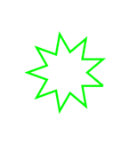

# TurtleBuilder

[](https://github.com/zonble/TurtleBuilder/actions)
[](https://travis-ci.org/zonble/TurtleBuilder)
[]()

[](https://github.com/zonble/turtlebuilder/blob/master/LICENSE)
[](https://twitter.com/zonble)

TurtleBuilder is a [turtle graphics](https://en.wikipedia.org/wiki/Turtle_graphics) made on the top of Swift's function builder. It allows you to use a [Logo](https://en.wikipedia.org/wiki/Logo_(programming_language))-like syntax to create and draw lines in your Swift project.

[](http://www.youtube.com/watch?v=mPF4nlYp-1c)

## Why?

Because it is fun!

## Requirement

- Xcode 11 or above
- Swift 5.1 or above

## Installation

You can install TurtleBuilder into your project via Swift Package Manager.

## Usage

### Build a Turtle

You can use a build block to build a turtle. For example:

``` swift
let turtle = Turtle {
        penDown()
        loop(9) {
            left(140)
            forward(30)
            left(-100)
            forward(30)
        }
        penUp()
}
```

Then you can get lines from the turtle, by calling `turtle.lines`. If you render it, it would look like



### Commands

TurtleBuilder provides following commands to let you control your turtle:

- pass: The command does nothing.
- center: Move the turtle to the center of the canvas.
- resetHeading: Reset the direction of the turtle. The turtle is facing to the top by default.
- setHeading: Set the direction of the turtle..
- penUp: After the command is called, the turtle moves without drawing a line.
- penDown: After the command is called, the turtle draw a line when it is moving.
- left | lt: Turn the turtle to left with a given degree.
- right | rt: Turn the turtle to right with a given degree.
- forward | fd: Ask the turtle to move forward.
- loop | repeat: Repeat running a set of commands.
- setMacro: Set a set of commands as a macro with a given name.
- playMacro: Play a macro. The macro needs to be set before.

## Draw In Views

TurtleBuilder provides two views where you can let the turtle to draw graphics. One is `TurtleView`, it renders the still lines with Quartz 2D, while another is `AnimatedTurtleView`, which creates animating layers using Core Animation.

You can use `AnimatedTurtleView` as following:


``` swift
let turtleView = AnimatedTurtleView(frame: self.view.bounds) {
    penDown()
    loop(10) {
        left(10)
        forward(10)
    }
    penUp()
}
```

Then call `turtleView.animate()` to start the animation.

## Known Issues

If you use variables in the commands within the `loop` command, we only take the values once. For example, if you have code as following:

``` swift
loop(5) {
   left(Int(arc4random() % 50))
   forward(Int(arc4random() % 50))
}
```

We do not generate new randrom numbers in each run of the loop, and the values sent to the commands remain identical.


Patches are welcome. Enjoy! 🐢
